# PyCCAPT

[](https://github.com/mmonajem/pyccapt/actions/workflows/tests.yml)
[](https://github.com/mmonajem/pyccapt/actions/workflows/lint.yml)
[](https://github.com/mmonajem/pyccapt/actions/workflows/docs.yml)
[](https://pypi.org/project/pyccapt/)
[](https://github.com/mmonajem/pyccapt/pkgs/container/pyccapt)
[](https://doi.org/10.5281/zenodo.10210507)
[](https://pyccapt.readthedocs.io/en/latest/?badge=latest)

PyCCAPT is a modular, FAIR-oriented Python package for atom probe tomography (APT) instrument control, data calibration, and reconstruction workflows.

It provides:

- experiment control and acquisition for APT hardware
- calibration workflows such as `t0` and flight-path estimation, ROI selection, voltage and bowl correction, and ranging
- reconstruction and visualization tooling
- interoperable data export for HDF5-based workflows and common APT exchange formats


## Project Scope

PyCCAPT was developed and validated on the OXCART atom probe platform and is designed to be adaptable to other APT systems through device-specific modules. Current integrations include detector backends such as Surface Concept and RoentDek, together with modular support for common laboratory hardware.

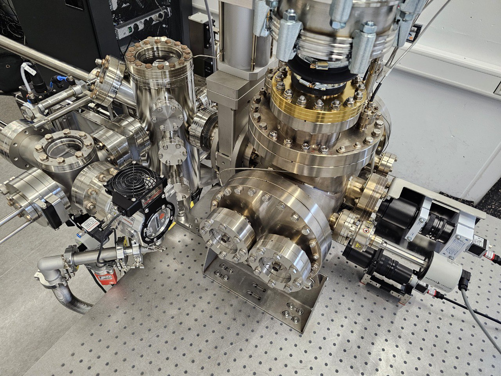

## Installation

PyCCAPT requires Python `>=3.9`.

### Recommended Quick Start (Conda)

For most users, this is the best way to install PyCCAPT:

```bash
conda create -n pyccapt python=3.11
conda activate pyccapt
python -m pip install --upgrade pip
pip install "pyccapt[full]"
```

If you want to work from this repository instead of PyPI:

```bash
git clone https://github.com/mmonajem/pyccapt.git
cd pyccapt
conda activate pyccapt
pip install -e ".[full]"
```

Predefined conda environment files are also included in the repo:

```bash
conda env create -f environment.yml
conda env create -f environment.full.yml
```

### Other Installation Options

1. Install from PyPI:

```bash
pip install pyccapt
```

Optional dependency groups:

```bash
pip install "pyccapt[calibration]"
pip install "pyccapt[control]"
pip install "pyccapt[full]"
```

Module-specific editable installs:

```bash
pip install -e ".[control]"
pip install -e ".[calibration]"
```

## Running PyCCAPT

Start the control application:

```bash
pyccapt
```

Fallback entrypoint:

```bash
python -m pyccapt.control
```

Run tests:

```bash
pytest -q --run-calibration
pytest -q --run-control
pytest -q
```

Run calibration tutorials:

```bash
jupyter lab
```

Then open notebooks under `pyccapt/calibration/tutorials`.

## Configuration

Control runtime configuration is stored in `pyccapt/config.toml`.

Control GUI electrode labels are stored in `pyccapt/control/electrode.toml`:

```toml
[electrodes]
names = [
  "NiC1", # Nickel electrode
  "CuC1", # Copper electrode
]
```

For device toggles, prefer `enabled` and `disabled`. Legacy `on` and `off` values still work.

## Control Highlights

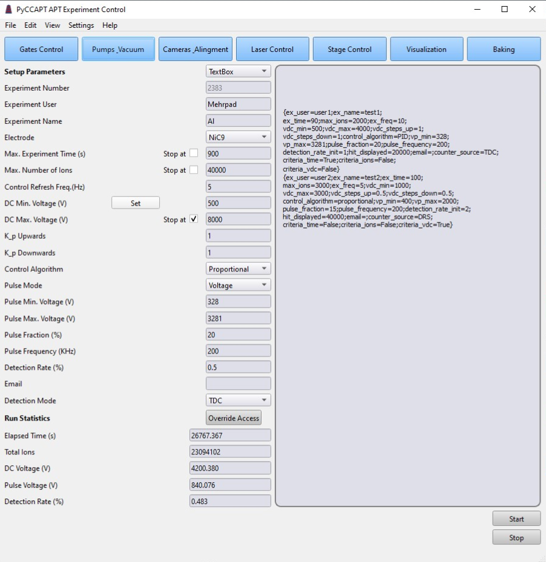

The control stack includes the main acquisition GUI together with dedicated windows for gates, pumps and vacuum, cameras, laser, stage control, visualization, and baking. Startup reports unavailable configured ports clearly, GUI error boxes wrap long messages, and `Access Override` now asks for confirmation before allowing a run to proceed with missing enabled devices.

Vacuum logs are written under `pyccapt/files/logs/vacuum`, and baking logs are written under `pyccapt/files/logs/baking/<timestamp>`.

## Calibration Highlights

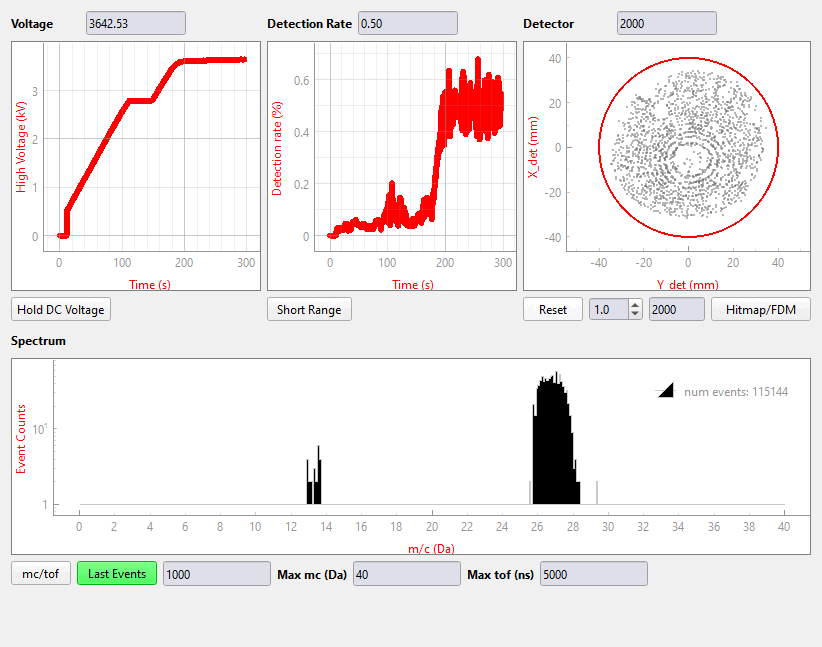

PyCCAPT calibration workflows cover detector hit maps, FDM views, mass-spectrum calibration, bowl and voltage correction, reconstruction, and downstream visualization.

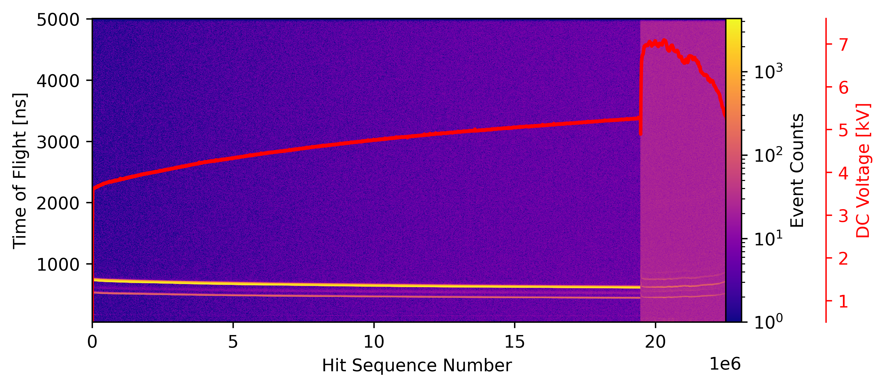

<p align="center">
  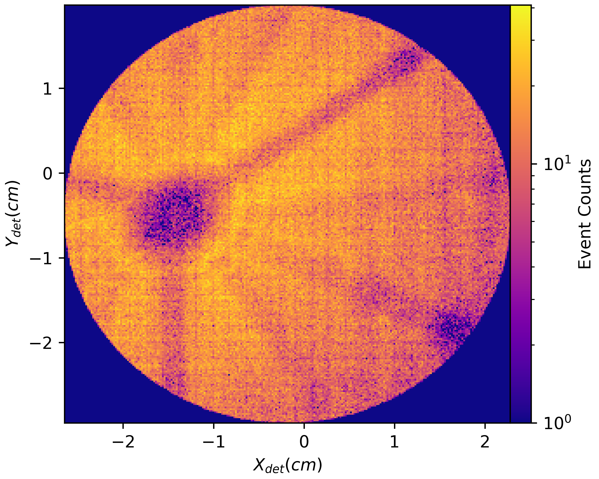
  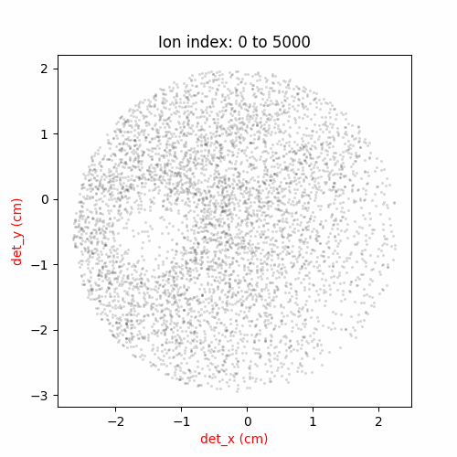
</p>

<p align="center">
  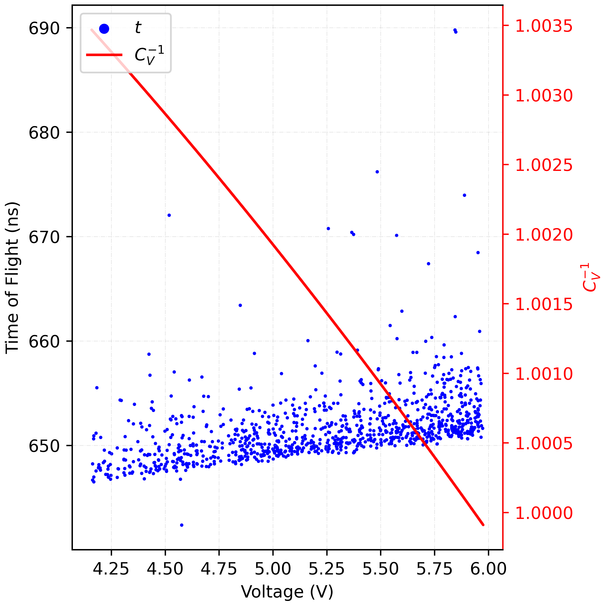
  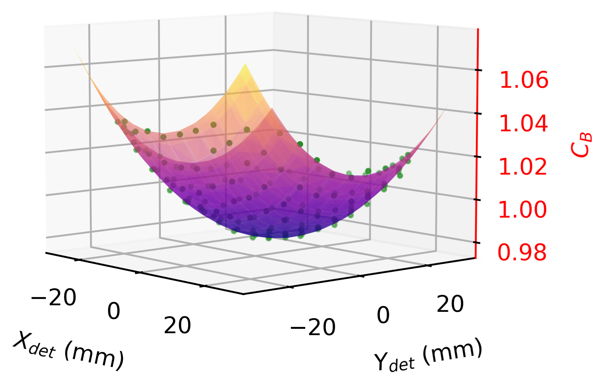
</p>

<p align="center">
  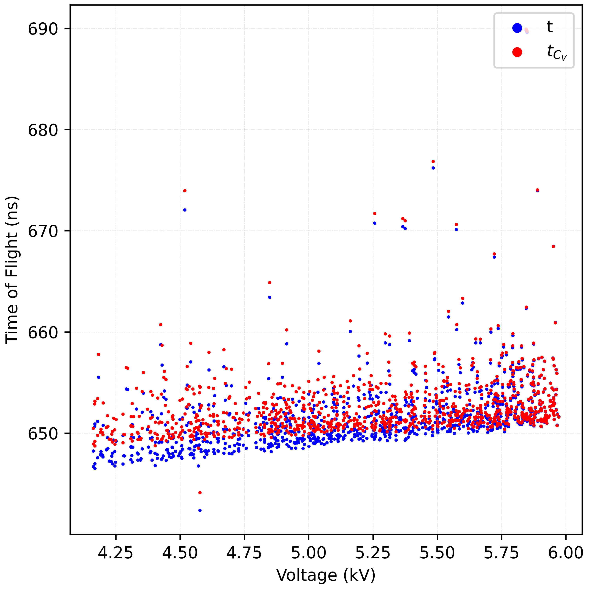
  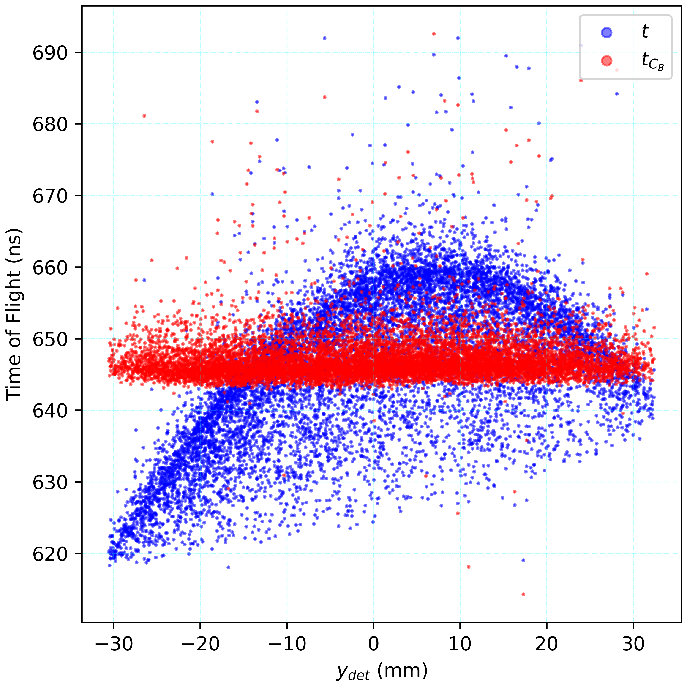
</p>

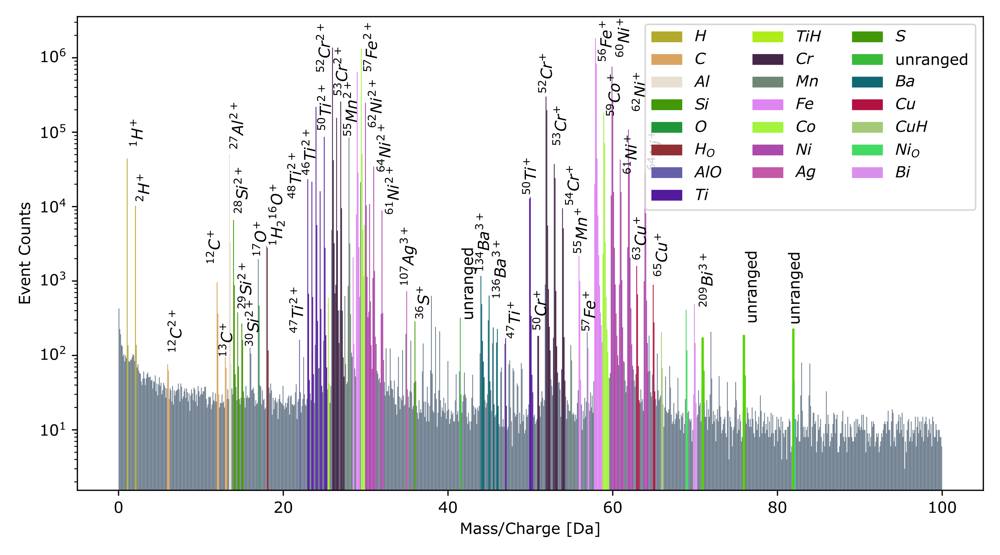

Processed calibration datasets can be exported as `HDF5`, `EPOS`, `POS`, and `ATO`.
Saved range tables can be reloaded from PyCCAPT `HDF5` files as well as IVAS/LEAP
range files in `.rrng` and `.rng` format.

The data-processing and visualization tutorials also expose a **Load raw tdc**
toggle and a matching **Save raw tdc** toggle. When both are enabled, the
raw `/tdc` group from the acquisition file is loaded alongside `/dld` and
linked event-by-event via a shared `event_group_id` column. Every cropping
step the user performs on `/dld` is then automatically reflected on the linked
raw rows when the calibrated dataset is saved, while raw rows that never had a
matching dld event are preserved untouched. See
[docs/Calibration_DATA_STRUCTURE.md](docs/Calibration_DATA_STRUCTURE.md) for
the on-disk schema.

The visualization helpers also include optional precipitate clustering with both
Min-Max and Maximum-Separation algorithms, plus iso-surface and proxigram
workflows for interface analysis.

For control part of the package you can follow the steps
on [documentation](https://pyccapt.readthedocs.io/).

<p align="center">
  
  
</p>

## Documentation

- Full documentation: [Read the Docs](https://pyccapt.readthedocs.io/)
- Control guide: [docs/configuration](https://pyccapt.readthedocs.io/en/latest/configuration.html)
- Calibration tutorials: [docs/tutorials](https://pyccapt.readthedocs.io/en/latest/tutorials.html)

Google Colab notebooks currently supported:

- [Data processing](https://colab.research.google.com/github/mmonajem/pyccapt/blob/main/pyccapt/calibration/tutorials/colab/data_processing.ipynb)
- [Visualization](https://colab.research.google.com/github/mmonajem/pyccapt/blob/main/pyccapt/calibration/tutorials/colab/visualization.ipynb)

Additional Jupyter-only widget workflows are available under
`pyccapt/calibration/tutorials/jupyter_files`, including
`L_and_t0_determination.ipynb`, `raw_data_analysis.ipynb`,
`cameca_raw_import.ipynb`, `reflectron_correction.ipynb`,
and `tapsim_node_builder.ipynb`.

## Data Structures

- Control data model: [pyccapt/control/DATA_STRUCTURE.md](pyccapt/control/DATA_STRUCTURE.md)
- Calibration data model: [pyccapt/calibration/DATA_STRUCTURE.md](pyccapt/calibration/DATA_STRUCTURE.md)

## Tutorial Dataset

Calibration tutorial data (pure aluminum), including raw and processed outputs, is available on Zenodo:

[](https://doi.org/10.5281/zenodo.14673955)

## Citation

If you use PyCCAPT in your work, please cite:

```bibtex
@article{monajem2025pyccapt,
  title={PyCCAPT: A Python Package for Open-Source Atom Probe Instrument Control and Data Calibration},
  author={Monajem, Mehrpad and Ott, Benedict and Heimerl, Jonas and Meier, Stefan and Hommelhoff, Peter and Felfer, Peter},
  journal={Microscopy Research and Technique},
  volume={88},
  number={12},
  pages={3199--3210},
  year={2025},
  publisher={Wiley Online Library}
}
```

Citation metadata is also available in [CITATION.cff](CITATION.cff).

## Contributing

Contributions are welcome. See [CONTRIBUTING.md](CONTRIBUTING.md) for development workflow and pull-request guidance.

## Support

- Issues and bug reports: [GitHub Issues](https://github.com/mmonajem/pyccapt/issues)
- Contact: Mehrpad Monajem (`mehrpad.monajem@fau.de`)

## License

PyCCAPT is licensed under the GNU General Public License v3.0. See [LICENSE](LICENSE).
