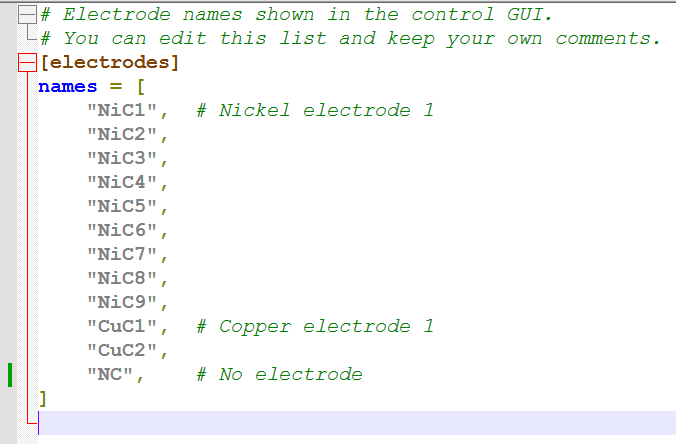
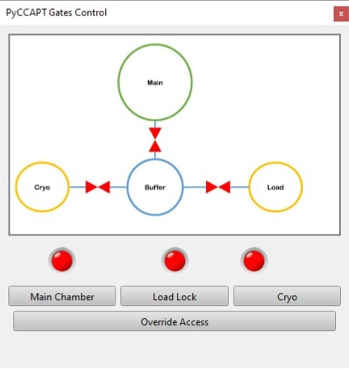
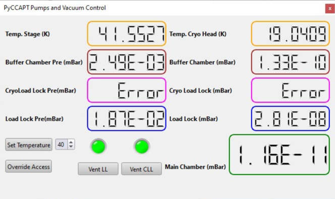
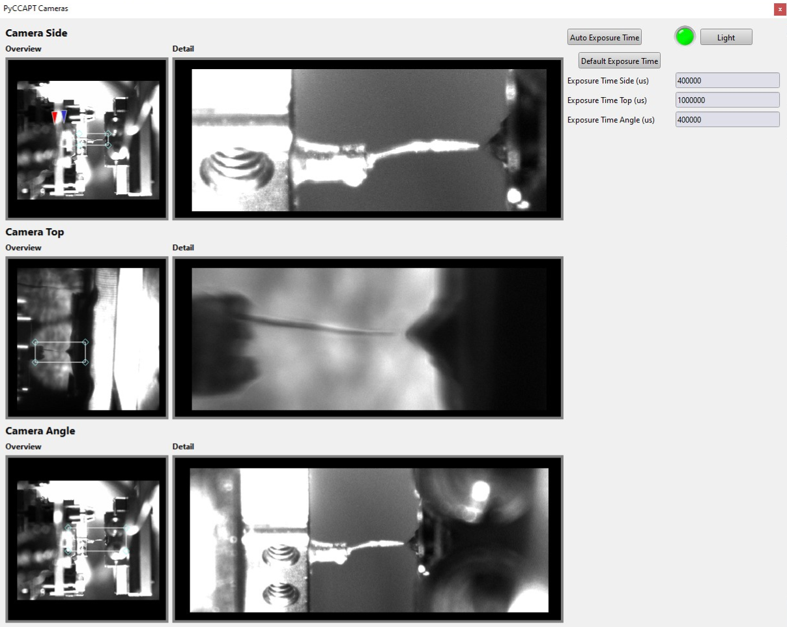
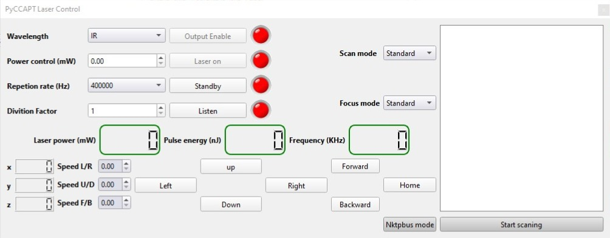
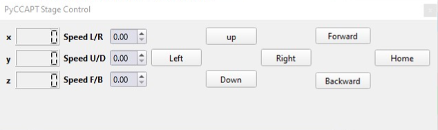
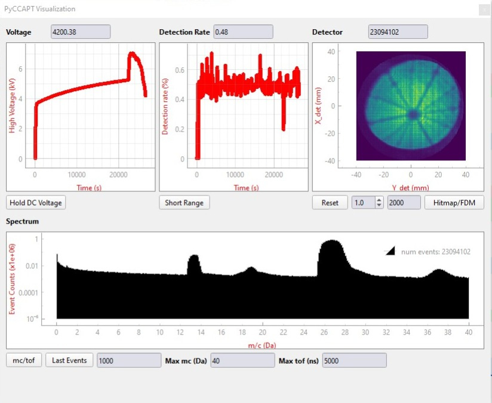
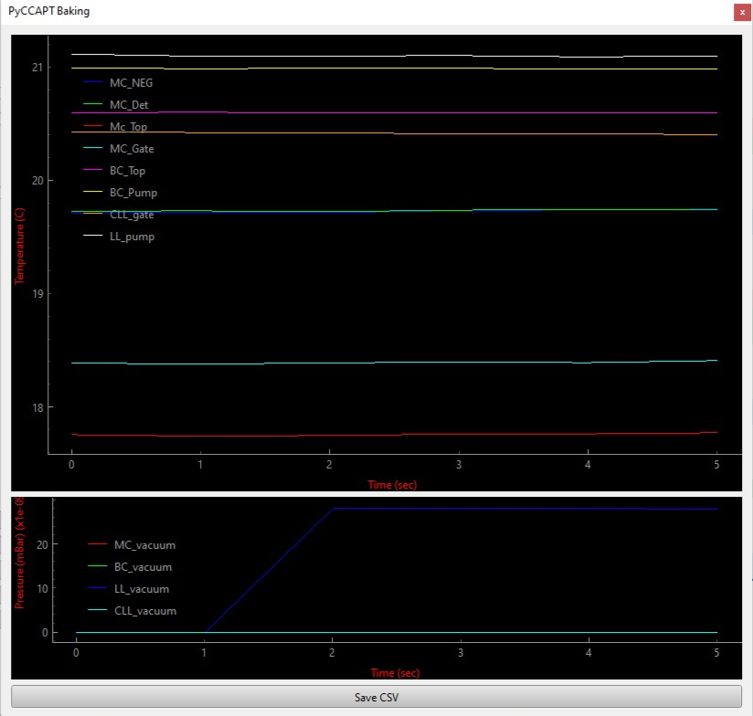

# Control Module

The `pyccapt.control` package provides instrument control, live monitoring, and experiment data acquisition workflows for open-source atom probe tomography systems.


## Responsibilities

The control module is responsible for:

- experiment orchestration and control loops
- communication with detector and auxiliary hardware
- GUI-based runtime operation and monitoring
- synchronized shared state across cooperating processes
- writing experiment metadata and acquisition streams

Calibration and reconstruction are implemented in `pyccapt.calibration`.

## Runtime Architecture

The application runs as multiple processes, typically including:

- main GUI process
- experiment/control process
- detector backend process (for example, Surface Concept, RoentDek, or DRS)
- optional sub-GUI processes

Shared state is handled via `pyccapt/control/core/share_variables.py`.

## Configuration

Control runtime configuration is loaded from `pyccapt/config.toml`.

- supported format: TOML
- device toggles should use `enabled` / `disabled`
- legacy `on` / `off` values still work

Electrode labels used in the GUI are configured in `pyccapt/control/electrode.toml`.

Example:

```toml
[electrodes]
names = [
  "NiC1", # Nickel electrode
  "CuC1", # Copper electrode
  "NC",   # Not categorized
]
```

Electrode naming in the control workflow:



Use the electrode list to match the naming shown in the GUI and your lab workflow. For example, `NiC1` refers to the nickel electrode and `CuC1` refers to the copper electrode.

## Startup Device Validation

- Enabled devices are validated when an experiment is started.
- If a required device cannot be opened, startup is blocked and the failure is reported in:
  - the main GUI warning area
  - terminal output
- `Access Override` now asks for confirmation before it bypasses those checks.

To proceed without a disconnected device in the normal path, set that device to `disabled` in `config.toml`.

## Data Output

Control-side HDF5 schema details are documented in [Control_DATA_STRUCTURE.md](Control_DATA_STRUCTURE.md).

Runtime logs are stored in:

- `pyccapt/files/logs/vacuum`
- `pyccapt/files/logs/baking/<timestamp>`

### Experiment logs

Two log files are written for every experiment:

| File | Location | Content |
|------|-----------|---------|
| GUI session log | `<project_root>/files/logs/gui/gui_<YYYY-MM-DD>.log` | All processes, all experiments for that day |
| Per-experiment log | `<exp_folder>/meta_data/apt.log` | Parameters, device state, stop reason |

When an experiment ends abnormally, search both files for `ERROR`, `CRITICAL`, `Traceback`, or `hdf_creator`.

### How experiment data is written

The detector backend writes data **incrementally** into chunk files during the run:

```
<exp_folder>/
├── temp_data/
│   └── chunks/
│       ├── x_chunk_1.npy
│       ├── x_chunk_2.npy
│       ├── y_chunk_1.npy
│       └── ...            (one file per stem per chunk flush)
└── meta_data/
    └── apt.log
```

At the end of the run, `hdf_creator.hdf_creator()` reassembles all chunks into the final HDF5:

```
<exp_folder>/
└── <exp_name>.h5          (final output; written atomically via a .tmp rename)
```

The `apt/*` group (`id`, `timestamps`, `num_events`, `num_raw_signals`, `temperature`, `experiment_chamber_vacuum`, and the `stage_*`/`laser_*` positions) is flushed to `apt_*` chunk files during the run and again at finalization, then reassembled into the final HDF5 alongside `dld/*` and `tdc/*`.

## Recovering a Missing HDF5 File

If the control PC crashed, the experiment was killed, or `hdf_creator` raised an exception, the final `.h5` may be absent while `temp_data/chunks/` still contains all the raw data.

### Step 1 — check the logs

Look for the failure reason in:

```
<exp_folder>/meta_data/apt.log
<project_root>/files/logs/gui/gui_<date>.log
```

### Step 2 — run the recovery script

`scripts/recover_chunks_to_hdf5.py` reassembles chunk files into a valid HDF5 file.

**Run it on the control computer** (requires `numpy` and `h5py`):

```bash
python scripts/recover_chunks_to_hdf5.py "D:\pyccapt\pyccapt\data\2512_Jun-10-2026_16-01_NiC1_C3"
```

Or copy the script into the experiment folder and run without arguments:

```bash
cd "D:\pyccapt\pyccapt\data\2512_Jun-10-2026_16-01_NiC1_C3"
python recover_chunks_to_hdf5.py
```

The script:

1. Discovers all chunk files under `temp_data/chunks/` and flat fallback files under `temp_data/`.
2. Loads each stem, skipping zero-byte or corrupted chunks with a warning.
3. **Reconciles unequal array lengths** within each group (`dld/*`, `tdc/*`) by truncating all arrays to the shortest present member and printing a report of any rows dropped.
4. Loads the full `apt/*` metadata group (`id`, `timestamps`, `num_events`, `num_raw_signals`, `temperature`, `experiment_chamber_vacuum`, `stage_x/y/z`, `laser_x/y/z`) from its `apt_*` chunk files.
5. **Legacy fallback only** (experiments with no `apt_*` chunks): reconstructs `apt/id`, `num_events`, and `num_raw_signals` from the `start_counter` arrays and zero/linear-fills `temperature`, `experiment_chamber_vacuum`, and `timestamps` (these fallback-only fields are not used by the calibration pipeline).
6. Prints the last 50 lines of `apt.log` so the failure reason is visible without opening a separate terminal.
7. Writes the output via an atomic `.tmp` → rename so the experiment folder is never left in a half-written state.

### What is and is not recovered

| Group / dataset | Recovered from chunks? | Notes |
|---|---|---|
| `dld/x`, `y`, `t` | Yes | Primary calibration data |
| `dld/high_voltage`, `voltage_pulse`, `laser_pulse` | Yes | |
| `dld/start_counter` | Yes | Aligns hits to control-loop steps |
| `tdc/*` | Yes | All six TDC datasets |
| `apt/id`, `num_events`, `num_raw_signals` | Yes | From `apt_*` chunks (or reconstructed from `start_counter` for legacy files) |
| `apt/temperature`, `experiment_chamber_vacuum`, `timestamps` | Yes | From `apt_*` chunks; zero/linear-filled only for legacy files without them |
| `apt/stage_x/y/z`, `laser_x/y/z` | Yes | Stage & laser-focus positions per loop step, from `apt_*` chunks |

For legacy experiments that predate `apt_*` chunk flushing, the recovery falls back to zero/linear-filling `apt/temperature`, `apt/experiment_chamber_vacuum`, and `apt/timestamps`; those fallback-only fields are not read by the calibration or reconstruction pipeline, so the recovered file is fully usable for all downstream analysis.

### Edge cases handled by the script

| Situation | Behaviour |
|-----------|-----------|
| Stem entirely absent | Dataset omitted from output; warning printed |
| Zero-byte or unreadable chunk | Chunk skipped; remaining chunks in that stem still loaded |
| Dtype mismatch between chunks | Each chunk cast to the expected dtype with a warning |
| Unequal lengths within `dld/*` or `tdc/*` | All arrays truncated to shortest; rows dropped are reported |
| Existing `.h5` in the folder | Interactive prompt before overwrite |
| `temp_data/` missing entirely | Error with hint to check the logs |

## GUI Overview


The main window is the experiment entry point. Long error messages now use a smaller wrapped font so port and device warnings remain readable inside the GUI instead of being clipped.

Sub-GUI views:

- Gates: 
- Pumps/Vacuum: 
- Cameras: 
- Laser: 
- Stage: 
- Visualization: 
- Baking: 
