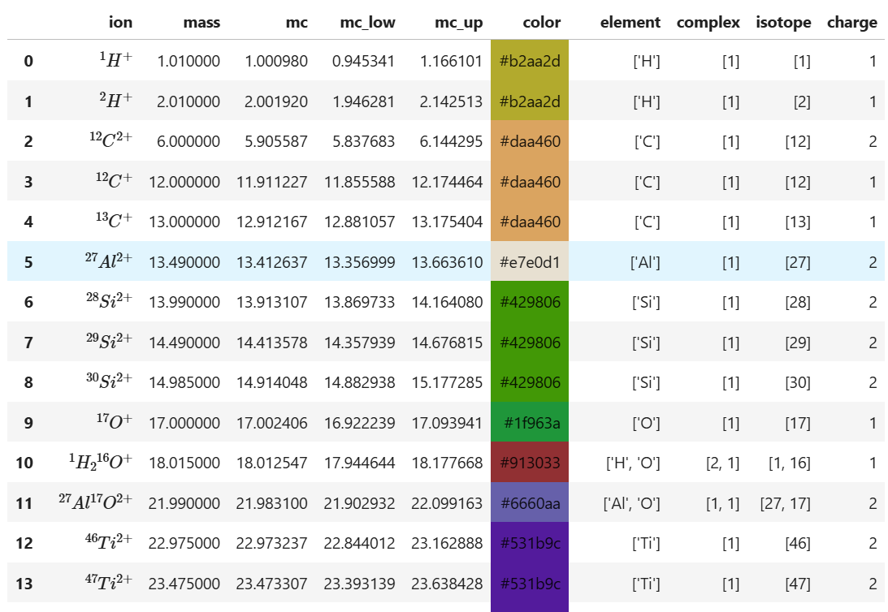

# Calibration and Range File Data Structure

This document provides an overview of the data structure within the HDF5 files of the PyCCAPT calibration module.
In the descriptions below, the notation "(n, )(unit, datatype)" is used to represent one-dimensional arrays with the
unit and data type specified. This structure remains consistent for all other information. For example,
"(n, )(nm, float64)" indicates a one-dimensional array in float64 data type with the unit "nm" (nanometers).
"N/A" is used to indicate that there is no specific unit associated with the data. 

### HDF5 file structure of PyCCAPT calibration module

This HDF5 file in PyCCAPT contains data with the following columns:

- `x (cm)`: (n,) (nm, float64) Reconstructed x position in nanometer.
- `y (cm)`: (n,) (nm, float64) Reconstructed y position in nanometer.
- `z (nm)`: (n,) (nm, float64) Reconstructed z position in nanometer.
- `mc (Da)`: (n,) (Da, float64) Bowl and voltage calibrated mass-to-charge ratio in Daltons.
- `mc_uc (Da)`: (n,) (Da, float64) Uncalibrated mass-to-charge ratio in Daltons.
- `high-voltage (V)`: (n,) (V, DC voltage value of the power supply.
- `pulse`: (n,) (V, float64) or (pJ, float64)  Pulse voltage or laser power.
- `t (ns)`: (n,) (ns, float64) Uncalibrated time-of-flight in nanosecond.
- `t_c (ns)`: (n,) (ns, float64) Bowl and voltage calibrated time-of-flight in nanosecond.
- `x_det (cm)`: (n,) (cm, float64) Detector x hit position of ions.
- `y_det (cm)`: (n,) (cm, float64) Detector y hit position of ions.
- `delta_p`: (n,) (N/A, uint32) Number of pulse since the last detected event pulse.
- `multi`: (n,) (N/A, uint32) Detected ions for each pulse.
- `start_counter`: (n,) (N/A, float64) The TDC counter value

There is also possibility to convert the PyCCAPT HDF5 file data to EPOS, POS, ATO, and CSV file. You can find the
example code in the tutorial section. A screenshot of the PyCCAPT HDF5 file is shown below.

### Range HDF5 file structure of PyCCAPT 

The range file contains the range of the mass-to-charge ratio. The range file is a HDF5 file with the following:

- `name`: (n,) (N/A, string) Ion name in simple format.
- `ion`: (n,) (N/A, string) Ion name in latex format.delta_p
- `mass`: (n,) (Da, float64) The mass-to-charge ratio of the element base on the elements weight and complexity.
- `mc`: (n,) (Da, float64) Peak location of mass-to-charge ratio in the dataset.
- `mc_low`: (n,) (Da, float64) The lower bound of the mass-to-charge ratio in the dataset for the peak.
- `mc_up`: (n,) (Da, float64) The upper bound of the mass-to-charge ratio in the dataset for the peak.
- `color`: (n,) (N/A, str) The color of the peak in the plot in hex format.
- `element`: (n,) (N/A, list of string) list of elements in the peak.
- `complex`: (n,) (N/A, list of uint32) complexity of the element (integer).
- `isotope`: (n,) (N/A, list of uint32) isotope list of element.
- `charge`: (n,) (N/A, uint32) charge of the element.

A screenshot of the range HDF5 file is shown below.

